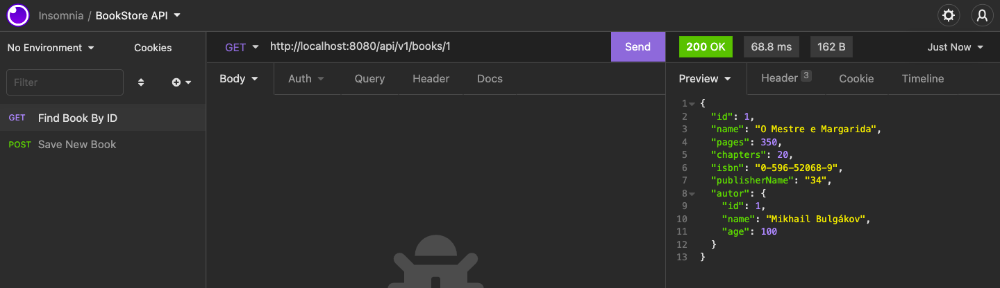

# BOOKSTORE MANAGER API PROJECT

Project deployed on [Heroku](https://bookstore-manager-raquel.herokuapp.com/)

## Initialized with Spring Initializer with the following dependencies:

## DB Model

## Endpoints Test - Insomnia

### POST - Create new book

- Local Request

- Request to https://bookstore-manager-raquel.herokuapp.com/api/v1/books

### GET - Find Book By ID

- Local Request

- Heroku Request

## Unit Tests - Not implemented yet

- Flux 1 -> book created successfully
- Flux 2 -> invalid isbn

